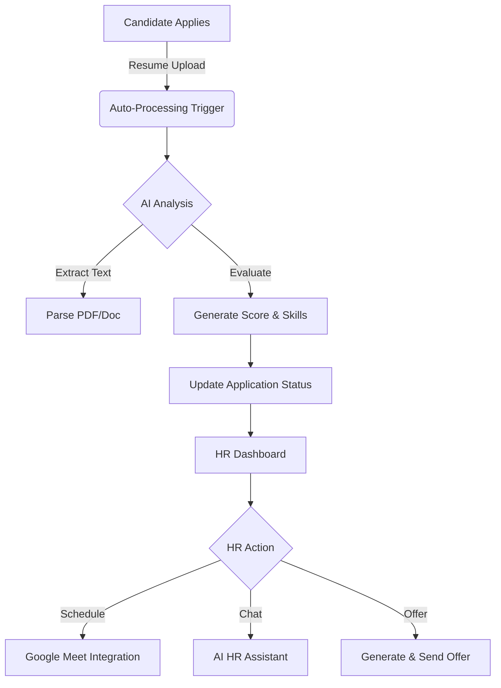

<div align="center">

# 🧠 CortexHR
### AI-Powered Recruitment Intelligence Platform


<p align="center">
  <br />
  <b>Automate. Analyze. Acquire.</b>
  <br />
  A comprehensive, AI-driven recruitment agent that streamlines the entire hiring lifecycle—from resume ingestion to offer letter generation.
  <br />
</p>

</div>

---

## 📋 Table of Contents

- [Overview](#-overview)
- [Architecture & Workflow](#-architecture--workflow)
- [Key Features](#-key-features)
- [Technology Stack](#-technology-stack)
- [Getting Started](#-getting-started)
- [Database Schema](#-database-schema)
- [Edge Functions API](#-edge-functions-api)
- [Project Structure](#-project-structure)
- [Roadmap](#-roadmap)

---

## 🎯 Overview

CortexHR transforms the traditional hiring process by leveraging advanced AI to handling repetitive tasks and provide deep insights.

**Core Capabilities:**
- 🤖 **Auto-Screening**: Instantly parse resumes, score candidates (0-100), and extract skills.
- 📅 **Smart Scheduling**: Integration with Google Calendar for seamless interview booking.
- 💬 **AI HR Assistant**: A conversational agent to answer recruiting queries and draft communications.
- ✉️ **Automated Outreach**: Generate personalized emails/offers based on context.

---

## 📐 Architecture & Workflow



### Complete Hiring Pipeline

1.  **Ingestion**: Candidates apply via Portal or Email (Gmail Sync).
2.  **Processing**: Edge functions extract text and analyze fit against Job Description.
3.  **Screening**: HR reviews AI-scored candidates.
4.  **Interview**: Automated scheduling & question generation.
5.  **Closing**: Offer generation and digital acceptance.

---

## ✨ Key Features

| Feature | Route | Description |
| :--- | :--- | :--- |
| **📊 Dashboard** | `/dashboard` | Central command center for metrics and activity. |
| **👥 Candidates** | `/dashboard/candidates` | Full lifecycle management with AI scoring and filtering. |
| **💼 Job Board** | `/careers` | Public-facing career page for applicants. |
| **📅 Scheduling** | `/dashboard/interviews` | Calendar view with Google Meet integration. |
| **📝 Offers** | `/dashboard/offers` | Draft, customize, and track offer letters. |
| **📧 Templates** | `/dashboard/templates` | Manage automated email communication templates. |
| **🤖 HR Chat** | `/dashboard/chat` | AI assistant for queries and drafting. |
| **🚪 Portal** | `/apply?token=...` | Secure candidate self-service portal. |

> [!NOTE]  
> Job Management is currently handled via the Database. A full UI for creating jobs at `/dashboard/careers` is on the roadmap.

---

## 🛠 Technology Stack

### Frontend
- **Framework**: React 18 + Vite
- **Language**: TypeScript
- **Styling**: Tailwind CSS + shadcn/ui
- **State/Query**: TanStack Query
- **Routing**: React Router v6

### Backend & Infrastructure
- **Platform**: Supabase
- **Database**: PostgreSQL
- **Auth**: Supabase Auth
- **Compute**: Deno Edge Functions
- **Storage**: Supabase Storage

---

## 🚀 Getting Started

### Prerequisites
- Node.js 18+
- Supabase Project

### Installation

1.  **Clone the repository**
    ```bash
    git clone <YOUR_GIT_URL>
    cd cortexhr
    ```

2.  **Install dependencies**
    ```bash
    npm install
    # or
    bun install
    ```

3.  **Environment Setup**
    Create a `.env` file in the root directory:
    ```env
    VITE_SUPABASE_URL=your_supabase_project_url
    VITE_SUPABASE_PUBLISHABLE_KEY=your_supabase_anon_key
    VITE_GOOGLE_CLIENT_ID=your_google_client_id
    ```

    **Edge Function Secrets:**
    You must set the following secrets in your Supabase project (via Dashboard or CLI):
    - `AIAPI_API_KEY`: API Key for Aiapi (required for all AI features).
    - `GOOGLE_CLIENT_ID`: OAuth Client ID for Google Calendar.
    - `GOOGLE_CLIENT_SECRET`: OAuth Client Secret for Google Calendar.
    - `SLACK_WEBHOOK_URL`: (Optional) Webhook URL for Slack notifications.
    - `SUPABASE_SERVICE_ROLE_KEY`: Required for admin operations in Edge Functions.

4.  **Run Development Server**
    ```bash
    npm run dev
    ```
    Visit `http://localhost:5173` to view the app.

---

## 📂 Project Structure

```
├── src
│   ├── components   # Reusable UI components (shadcn/ui)
│   ├── hooks        # Custom React hooks
│   ├── integrations # Third-party services (Supabase client)
│   ├── lib          # Utilities and helpers
│   └── pages        # Route components (Dashboard, Login, etc.)
├── supabase         # Backend logic
│   └── functions    # Deno Edge Functions
└── public           # Static assets
```

---

## ⚡ Edge Functions API

Our backend logic is distributed across specialized Edge Functions:

| Function | Purpose | Input |
| :--- | :--- | :--- |
| `auto-process-application` | **Trigger**: New applications. Orchestrates parsing & scoring. | Application ID |
| `parse-resume` | Analyzes resume text vs Job Requirements. | Resume Text, Job Req |
| `extract-pdf-text` | OCR/Vision extraction for PDF resumes. | PDF URL |
| `generate-email-draft` | AI-generated communication drafts. | Candidate Context, Type |
| `generate-interview-questions` | Creates custom interview scripts. | Candidate Profile |
| `hr-chat` | Backend for the conversational assistant. | Message History |
| `google-calendar` | Manages events and Meet links. | OAuth Token, Event Details |

---

## 👥 User Roles (RLS)

- **Admin**: Full system access.
- **Recruiter**: Standard hiring operations.
- **HR Manager**: Team oversight.
- **Public**: Can view active job posts.

---

## 🔮 Roadmap

- [ ] **Phase 1 (Q1 2025)**: Bulk Actions, Advanced Filtering.
- [ ] **Phase 2 (Q2 2025)**: Video Interview Integration.
- [ ] **Phase 3 (Q3 2025)**: LinkedIn Integration, Background Checks.

---

<p align="center">
  Builder.
</p>
